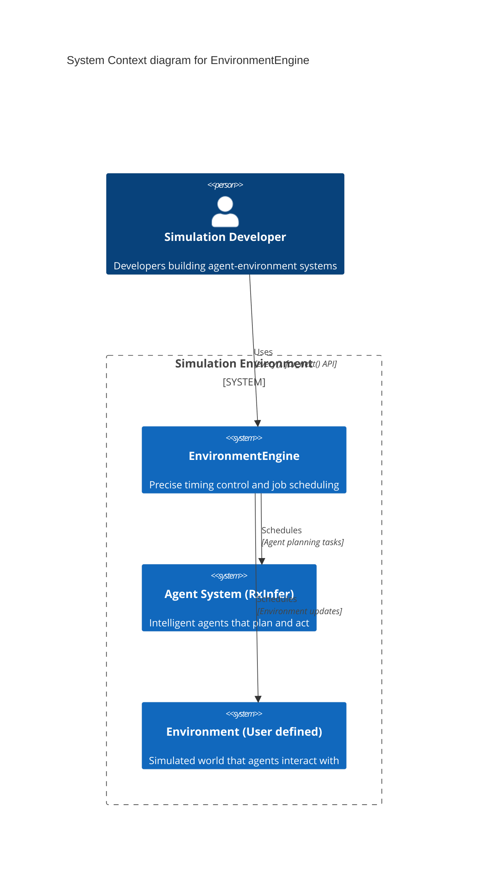
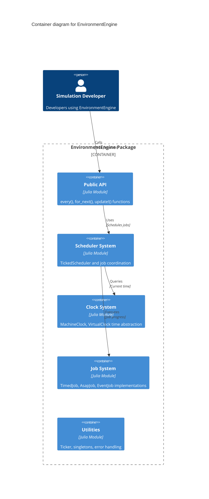
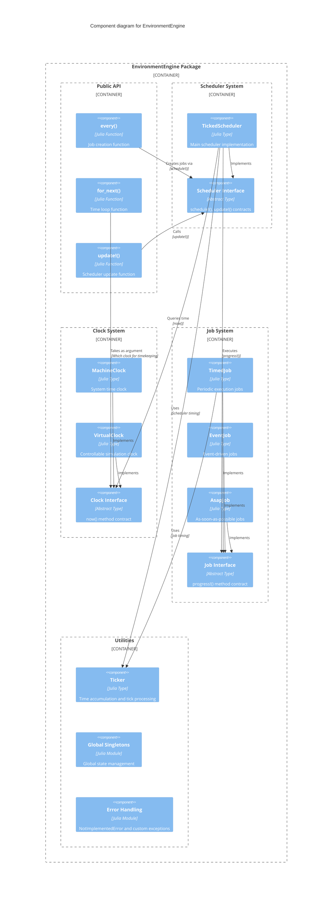

# [C4 Model](@id architecture-c4-model)

This page contains the complete C4 model for EnvironmentEngine, showing the architecture at all levels from system context down to detailed components.

## Level 1: System Context

EnvironmentEngine sits at the heart of simulation systems, providing precise timing control for agent-environment interactions:

## Level 2: Container Architecture

EnvironmentEngine is organized into several key containers, each with specific responsibilities:

This level shows the main modules within EnvironmentEngine and how they interact. The Public API is the entry point, while the Scheduler coordinates between the Clock System and Job System.

## Level 3: Component Architecture

The detailed component view shows how the different parts of EnvironmentEngine interact:

This level shows the detailed components within each container. The TickedScheduler is the core component that coordinates between clocks and jobs, while the Ticker utility provides shared timing functionality.

## Key Relationships

### System Context Level
- **Simulation Developers** use EnvironmentEngine's simple API (`every()`, `for_next()`) to schedule tasks
- **EnvironmentEngine** coordinates timing between agent planning and environment updates, enabling complex simulation scenarios

### Container Level
- **Public API** provides the main interface for users
- **Scheduler System** manages job execution and timing coordination
- **Clock System** provides time abstraction with machine and virtual clocks
- **Job System** defines different types of executable tasks
- **Utilities** handle shared components like Ticker and global state management

### Component Level
- **TickedScheduler** coordinates between clocks and jobs, calling `progress!()` on jobs at appropriate times
- **Ticker** provides shared timing functionality used by both schedulers and timed jobs
- **Interface components** define contracts that concrete implementations must follow
- **Global singletons** provide default instances for simple use cases (though explicit instances are recommended)